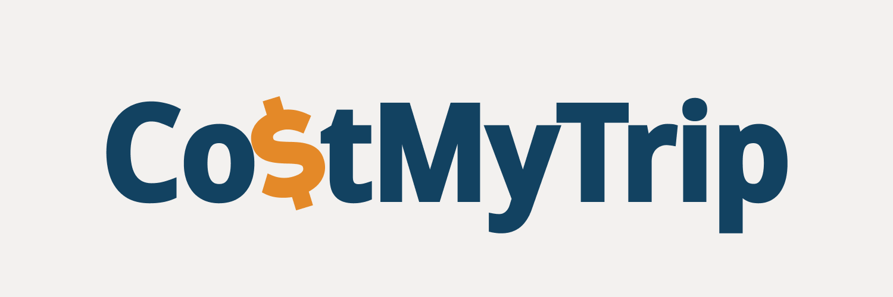

# CostMyTrip



**URL:** [https://www.costmytrip.com](https://www.costmytrip.com)

## About

CostMyTrip is a community-driven platform where travelers can share their actual travel expenses and browse cost information from other users. This helps future travelers plan their budgets more accurately based on real-world data.

## Design System

### Color Theme

- **Primary (Dark Blue):** `#124261`
- **Secondary (Teal):** `#227461`
- **Accent (Orange):** `#E48928`
- **Background (Beige):** `#F3F1EF`

### Typography

- **Primary Font:** Noto Sans - For general text and UI elements
- **Monospace Font:** Noto Sans Mono - For prices, dates, and code-like content

### MVP Features

- **Expense Card Creation** - Users can post detailed expense information for their trips
- **City Browse** - Explore expense cards from major cities around the world

## Project Structure

```
src/
├── app/                  # Routing (Next.js App Router)
│   ├── auth/            # Authentication-related APIs
│   └── ...              # Page files
├── components/          # React components
│   ├── elements/        # Common reusable components
│   └── layouts/         # Common page layouts (e.g., header, footer)
├── features/            # Feature-based components
├── utils/               # General-purpose helper functions (formatting, validation, etc.)
└── types/               # TypeScript type definition files
```
